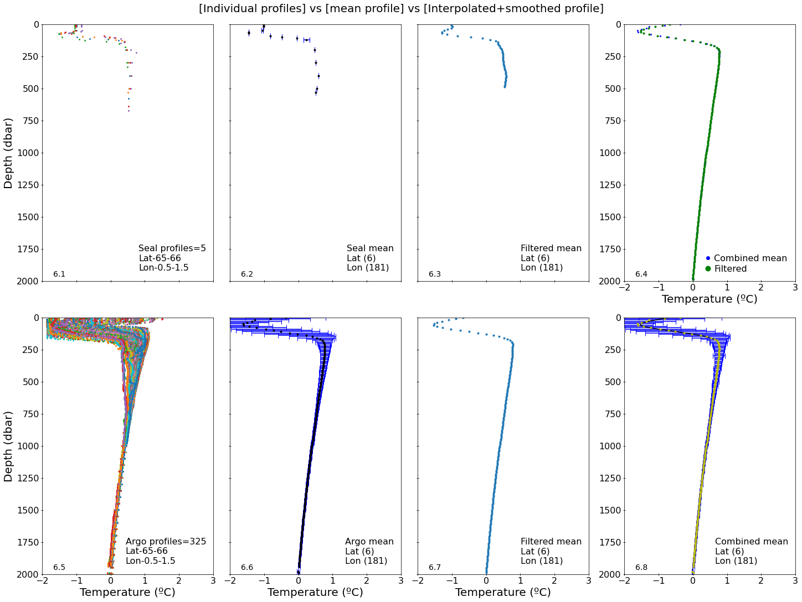
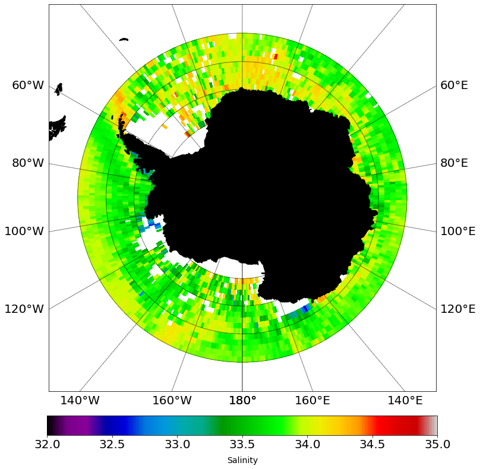

# Southern Ocean Argo and Animal-Borne Observational Data

Research code associated with Southern Ocean observational-data work carried out with the **University of Auckland Centre for eResearch** in 2019.

This repository is a fork of the original [UoA-eResearch/argo](https://github.com/UoA-eResearch/argo) project and preserves the collaborative computational and scientific workflow developed during that research.

## Research Context

The project involved irregularly sampled Southern Ocean observations, including:

- Argo profiling-float observations
- animal-borne oceanographic observations
- seawater temperature and salinity profiles
- profile aggregation and filtering
- spatial gridding and interpolation
- combined observational products
- climatological analysis
- scientific visualisation

The work addressed the challenge of combining observational systems with substantially different spatial sampling characteristics.

## Scientific Workflow

`observational profiles -> spatial selection -> profile aggregation -> filtering -> gridding/interpolation -> combined observations -> oceanographic fields -> climatological products`

## Observational Integration

Argo profiling floats and animal-borne observations provide complementary sampling of the Southern Ocean.

The workflow supported the processing and integration of these observations into regularly organised oceanographic fields for physical interpretation, comparison and climatological analysis.

## Repository Contents

The repository preserves:

- Argo profile data
- animal-borne profile data
- Jupyter-based analysis
- gridded temperature products
- gridded seawater salinity products
- seawater density products
- combined observational fields
- standard-deviation products
- supporting CSV files
- scientific visualisations

Examples of preserved derived products include:

`argo_temp_grid_withdepth.npy`

`seal_temp_grid_withdepth.npy`

`combined_temp_grid_withdepth.npy`

together with associated statistical and oceanographic products.

## Main Analysis Notebook

`plot.ipynb`

The notebook preserves the principal exploratory, computational and visualisation workflow developed during the project.

## Selected Scientific Visualisations

The figures below are preserved outputs from the original Southern Ocean observational-analysis workflow.

### Southern Ocean Observational Analysis

  

  <em>Southern Ocean observational analysis using complementary Argo profiling-float and animal-borne oceanographic observations.</em>

### Vertical Profile Analysis

  

  <em>Vertical-profile analysis illustrating the processing and comparison of Southern Ocean observational data.</em>

### Gridded Observational Analysis

  

  <em>Example of a gridded observational product generated within the Southern Ocean analysis workflow.</em>

## Project History and Contributions

This repository is a fork of the original University of Auckland Centre for eResearch repository:

[UoA-eResearch/argo](https://github.com/UoA-eResearch/argo)

The computational workflow was developed collaboratively during the 2019 research project.

**Nick Young** led the early software implementation and development of the analysis workflow.

**Fabio Vieira Machado** contributed to the scientific development, observational-data analysis, interpretation, visualisation, and subsequent extension of the workflow, including additional gridded seawater salinity and density products.

The repository is preserved as a record of that collaborative research work and subsequent development.

## Historical Research Environment

This repository reflects the scientific-computing environment used during the original research period.

Some dependencies, installation instructions and code structures therefore represent a historical research workflow rather than a current production Python package.

The repository should not be interpreted as a formally frozen archival software release.

## Research Areas

- Physical Oceanography
- Southern Ocean
- Argo profiling floats
- Animal-borne ocean observations
- Oceanographic data processing
- Seawater temperature, salinity and density
- Irregular spatial sampling
- Scientific Python
- Gridding and climatological analysis
- Scientific visualisation

## Contributors

- **Nick Young** - early software development and implementation
- **Fabio Vieira Machado** - scientific development, oceanographic analysis, visualisation, and subsequent code contributions, including gridded seawater salinity and density products

Fabio Vieira Machado ORCID: [0000-0003-0723-075X](https://orcid.org/0000-0003-0723-075X)

## License

MIT License. See the repository `LICENSE` file.
